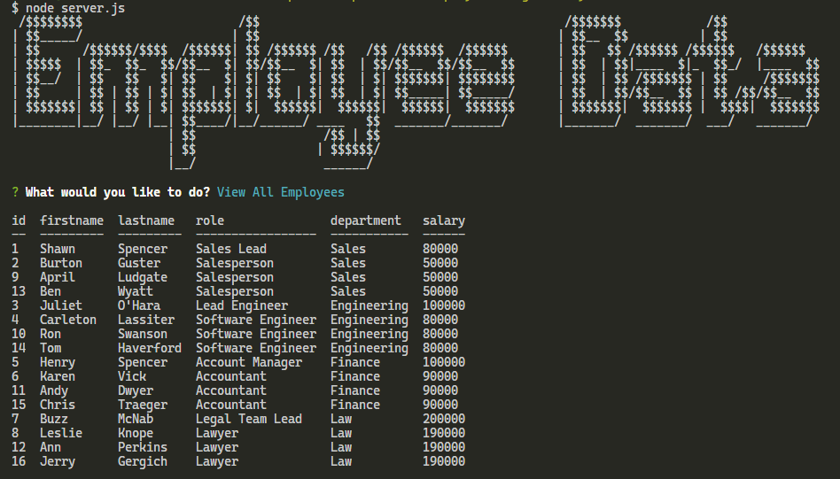
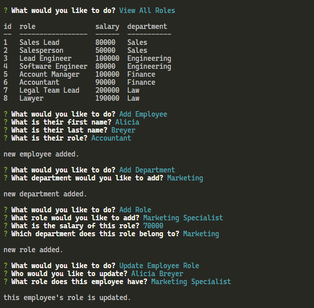

# employee-management-system

 

## Description

Command-line application that lets users manage a company's employees using node, inquirer, and MySQL. This Content Management System lets users interact with stored information in the databases where they can add, view, and update departments, roles, and employees. [Watch the video](https://drive.google.com/file/d/14IboXDxaqCr_O1D7_KbBlv0kQW4rsOfl/view?usp=sharing) to see how to use or follow the steps.

## How To

- Clone repository and follow steps below
- Install dependencies from package.json
- Add mysql schema in mysql and create table
- Add seed contents into mysql
- Enter node server.js in terminal to start server
- Choices will appear in the terminal
- Click through the options to perform different actions
- Exit when done

### Usage Video

[video of how to use note-taker](https://drive.google.com/file/d/14IboXDxaqCr_O1D7_KbBlv0kQW4rsOfl/view?usp=sharing)

### License

MIT License

### Screenshots

